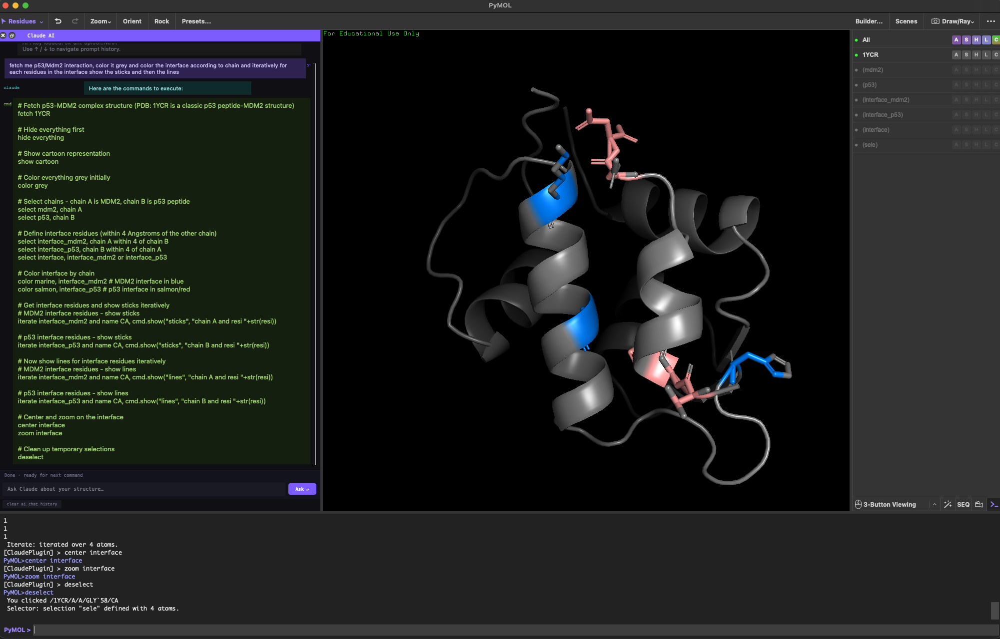

# 🧬 Claude AI Plugin for PyMOL

A PyMOL plugin that embeds a Claude AI chat panel directly inside the PyMOL window, allowing you to control molecular visualizations using plain natural language.

> **"fetch 1hpv and show as cartoon, color by chain"** → executed instantly.



---

## Features

- 💬 **Docked chat panel** — lives inside the PyMOL window, dockable to any edge
- 🧠 **Natural language → PyMOL commands** — powered by Claude AI
- ⌨️ **Prompt history** — navigate previous inputs with `↑` / `↓`

Feel free to optimize the system promt for claude at SYSTEM_PROMPT in the .py file!! 

---

## Requirements

| Requirement | Version |
|---|---|
| PyMOL | 2.0+ (open-source or incentive) |
| Python | 3.7+ |
| `anthropic` Python package | latest |
| Anthropic API key | [console.anthropic.com](https://console.anthropic.com) |

> **Note:** This plugin uses PyMOL's built-in Qt GUI toolkit. It does **not** require XQuartz or any additional GUI libraries.

---

## Installation

### 1. Install the `anthropic` Python package

Run this in your terminal **before** opening PyMOL or run in the PyMOL terminal interface:

```bash
pip install anthropic
```

If you are using a conda-based PyMOL installation:

```bash
conda activate pymol
pip install anthropic
```

### 2. Install the plugin in PyMOL

**Option A — Plugin Manager (recommended, persists across restarts):**

1. Open PyMOL
2. Go to **Plugin → Plugin Manager**
3. Click the **Install New Plugin** tab
4. Click **Choose file...** and select `claude_pymol_plugin.py`
5. Click **OK**

**Option B — Load for current session only:**

In the PyMOL command line:
```
run /path/to/claude_pymol_plugin.py
```

### 3. Set your API key

In the PyMOL terminal, run this **once**. The key is saved permanently to `~/.claude_pymol_config.json` and loaded automatically on every subsequent startup:

```
ai_key YOUR_ANTHROPIC_API_KEY
```

You can get an API key at [console.anthropic.com](https://console.anthropic.com).

---

## Getting an API Key

1. Go to [console.anthropic.com](https://console.anthropic.com) and sign up or log in
2. Navigate to **API Keys** in the left sidebar
3. Click **+ Create Key**, give it a name (e.g. `pymol`)
4. Copy the key and paste it into PyMOL: `ai_key sk-ant-...`

> API usage is billed per token. A typical PyMOL session costs only a few cents.

---

## Usage

### Opening the chat panel

```
ai_chat
```

Or go to **Plugin → Claude AI** in the menu bar. The panel docks to the right side of the PyMOL window by default.

### Sending natural language commands

Type directly in the panel's input field and press **Enter** (or click **Ask ↵**), or use the `ai` command in the PyMOL terminal:

```
ai fetch 1hpv and show as cartoon
ai color chain A blue and chain B red
ai show the active site residues as sticks
ai align all loaded structures to 1hpv
ai render a high quality ray traced image
ai show molecular surface colored by hydrophobicity
ai select all alpha helices and color them red
ai hide everything and show only the ligand as spheres
```

Claude translates your request into PyMOL commands, shows them in the panel, and executes them immediately.

### Navigating prompt history

While the input field is focused:

| Key | Action |
|---|---|
| `↑` | Go back through previous prompts |
| `↓` | Go forward (restores your draft if you haven't submitted) |

---

## All Commands

### Terminal commands

| Command | Description |
|---|---|
| `ai <query>` | Translate natural language to PyMOL commands and execute |
| `ai_chat` | Toggle the docked chat panel open/closed |
| `ai_key YOUR_KEY` | Set and **save** the API key (persists across restarts) |
| `ai_key_clear` | Delete the saved API key from disk |
| `ai_clear` | Clear the Claude conversation history |
| `ai_help` | Show help and current key status in the terminal |


## Example Workflow

```
# Load a structure
ai fetch 6lu7

# Visualize
ai show as cartoon and color by chain

# Highlight a region
ai select residues 40 to 50 in chain A and show as sticks, color red

# Render
ai set ray_opaque_background, 0 and ray trace a high quality image, save as output.png
```

---
